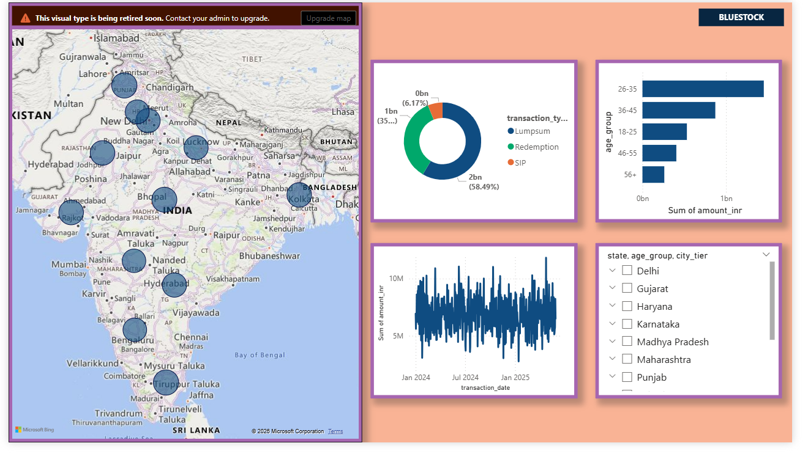

# Mutual Fund Analytics Capstone

## Overview

This project is an end-to-end Mutual Fund Analytics Platform developed using Python, SQLite, and Power BI. The objective is to transform raw mutual fund and investor transaction data into actionable insights through data engineering, financial analytics, and interactive dashboards.

## Features

* Data Cleaning & Preprocessing
* SQLite Database Design
* Exploratory Data Analysis (EDA)
* Fund Performance Analytics
* Risk Analytics
* Investor Behavior Analysis
* Power BI Dashboard
* Rule-Based Fund Recommendation Engine

## Tech Stack

* Python
* Pandas
* NumPy
* SQLite
* Matplotlib
* Seaborn
* Power BI

## Project Structure

```text
Data/
├── raw/
├── processed/

Database/
├── mutual_fund.db

notebooks/
├── 01_Data_Cleaning.ipynb
├── 02_EDA.ipynb
├── 03_Advanced_Analytics.ipynb

scripts/
├── recommender.py

Reports/
├── Final_Report.pdf
├── Bluestock_MF_Presentation.pptx
```

## Key Analytics

### Performance Metrics

* CAGR
* Annualized Return
* Sharpe Ratio
* Sortino Ratio
* Alpha
* Beta
* Tracking Error

### Risk Metrics

* Value at Risk (VaR)
* Conditional VaR (CVaR)
* Rolling Sharpe Ratio

### Investor Analytics

* Cohort Analysis
* SIP Continuity Analysis
* Demographic Analysis

## Dashboard Pages

1. Industry Overview
2. Fund Performance
3. Investor Analytics
4. SIP & Market Trends

## Key Findings

* Risk-adjusted returns provided better fund comparison than absolute returns.
* SIP inflows showed steady growth.
* Several funds generated positive alpha against benchmarks.
* Investor participation increased across newer cohorts.

## Future Scope

* Machine Learning Recommendations
* Real-Time NAV Integration
* Portfolio Optimization
* Investor Segmentation

## Live Dashboard

Dashboard Link: https://app.powerbi.com/links/4mqN8CBXXK?ctid=edc5c3bf-4ab5-4697-84fa-41b44eb08b5e&pbi_source=linkShare&bookmarkGuid=5da124ea-dc52-47d1-a21e-6c253a32407b

## Author

Ritik Kumar

